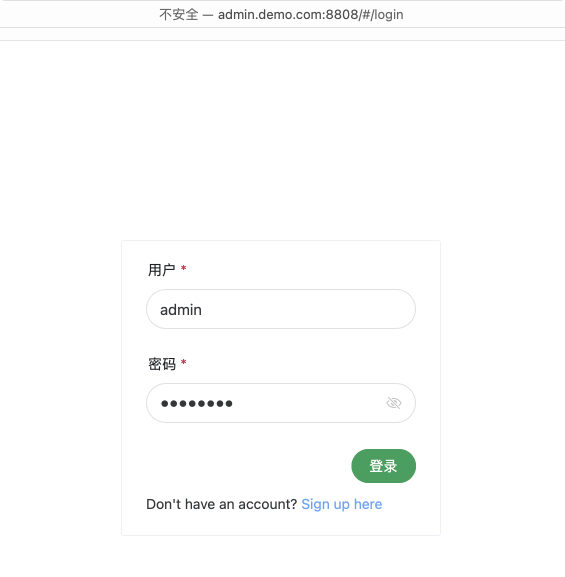
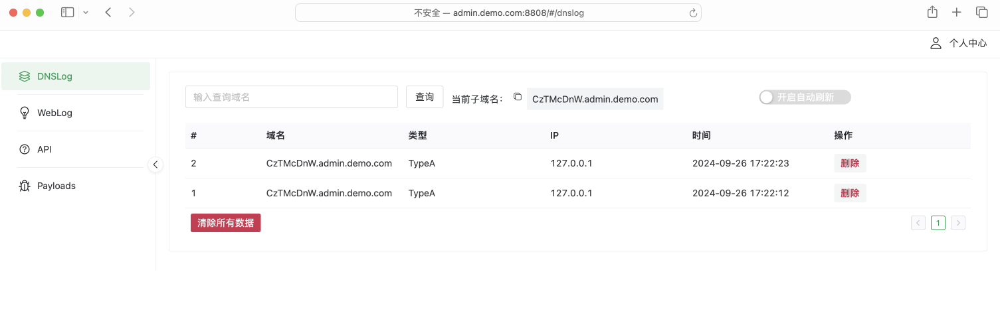
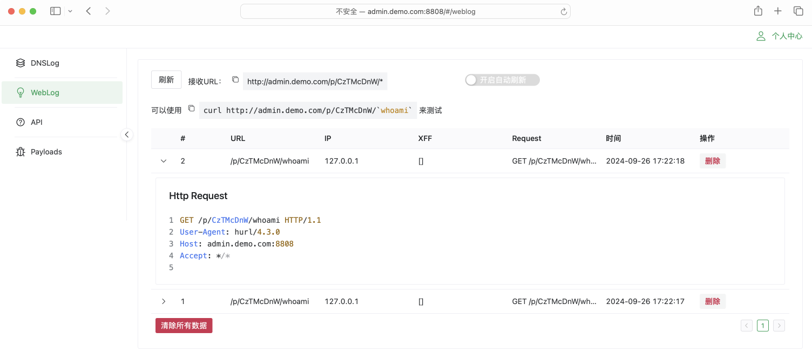

# Plumb 1.0.0 

一个轮子，用于渗透测试优化的 DNS/HTTP 日志工具，简洁、轻便、更易于使用。

## Chang Log

* 2024-09-26： 初始版对外发布

## 功能说明

* 简洁，显示捕获的完整 Request 信息（Headers、Body）
* 支持监控新记录自动刷新
* 数据库存储轻量化，使用 sqlite db 进行存储，简单便捷

## 功能截图





## 部署

在应用文件同级目录中创建 `config.yaml` 文件，并增加如下内容：

```yaml
HTTP:
  host: 0.0.0.0
  # WebLog监听端口
  port: 80
  jwt_secret: "jwt_secret"

DNS:
  # DnsLog接收域名
  domain: log.jgeek.cn

DATABASE:
  type: sqlite
  # 本地数据库路保存路径，不存在将会新建数据库及用表
  path: ./Plumb.sqlite3
```

域名需做好 NS 指向，运行后请在域名后加 `/#/login` 进行访问，默认登录账号：`admin/Admin12345`


## 致谢

* [eyes.sh](https://github.com/lijiejie/eyes.sh)
* [DNSlog-GO](https://github.com/lanyi1998/DNSlog-GO)
